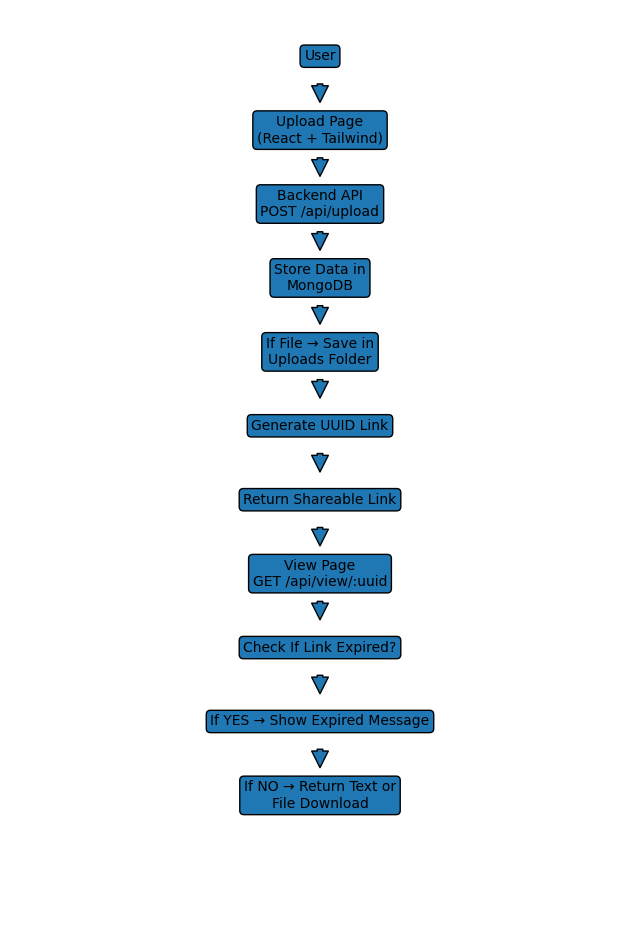

# LinkVault

## Objective

LinkVault is a full-stack web application that allows users to securely
upload either plain text or a file and share it using a unique,
hard-to-guess link. The uploaded content is accessible only through the
generated link and automatically expires after a specified time.

This project demonstrates secure link-based content sharing similar to
systems like Google Drive, Pastebin, or TinyURL.

------------------------------------------------------------------------

## Tech Stack

### Frontend

-   React (Vite)
-   Tailwind CSS

### Backend

-   Node.js
-   Express.js

### Database

-   MongoDB (Mongoose)

### To Run the Project 
To Run frontend

-   cd frontend
-   npm run dev

To Run Backend
-  cd backend
-  node server.js

------------------------------------------------------------------------

## Setup Instructions

### 1. Clone Repository

git clone `https://github.com/Khushalrd20/Linkvault_project.git`{=html} cd LinkVault

------------------------------------------------------------------------

### 2. Backend Setup

cd backend npm install

Create a .env file inside the backend folder:

PORT=5000 MONGO_URI=mongodb://127.0.0.1:27017/linkvault

Start backend:

npm start

------------------------------------------------------------------------

### 3. Frontend Setup

cd frontend npm install npm run dev

Open in browser: http://localhost:5173

------------------------------------------------------------------------

## Functional Overview

### 1. Upload Functionality

Users can upload: - Plain text, or - A file (any format)

Only one type of content is required per upload.

------------------------------------------------------------------------

### 2. Link Generation

After successful upload: - The backend generates a UUID. - A unique URL
is created in the format:

/view/:uuid

-   The link is returned to the frontend.
-   The link remains valid until expiry.

------------------------------------------------------------------------

### 3. Access Control

-   Content is accessible only through the exact generated link.
-   There is no public listing or search functionality.
-   Invalid or expired links return appropriate HTTP responses.

------------------------------------------------------------------------

### 4. Expiry Handling

-   Users may optionally specify expiry time in minutes.
-   If not specified, default expiry is 10 minutes.
-   After expiry:
    -   Content is no longer accessible.
    -   The frontend displays an expired message.

------------------------------------------------------------------------

### 5. Content Retrieval

For Text Uploads: - Text is displayed in readable format. -
Copy-to-clipboard functionality is provided.

For File Uploads: - A download option is provided. - File is served
securely from backend.

------------------------------------------------------------------------

## API Overview

### Upload Endpoint

POST /api/upload

Handles: - Text upload - File upload - Expiry handling - UUID generation

Response:

{ "link": "http://localhost:5173/view/`<uuid>`{=html}" }

------------------------------------------------------------------------

### Retrieve Content Endpoint

GET /api/view/:id

Returns: - Text (if available) - File URL (if available) - Expiry
validation

HTTP Status Codes: - 200 -- Success - 404 -- Not Found - 410 -- Expired

------------------------------------------------------------------------

## Design Decisions

-   UUID is used to prevent predictable URLs.
-   MongoDB stores:
    -   uuid
    -   text
    -   fileUrl
    -   expiresAt
-   Backend handles expiry validation to prevent unauthorized access.
-   Frontend includes countdown timer for better user experience.
-   No authentication system is implemented as per base requirements.

------------------------------------------------------------------------

## Data Flow (High-Level)

1.  User uploads text or file.
2.  Frontend sends data to backend.
3.  Backend stores content in MongoDB and saves file in uploads folder.
4.  Backend generates UUID and returns shareable link.
5.  User shares link.
6.  Recipient accesses content via /view/:uuid.
7.  Backend validates expiry and returns content.

------------------------------------------------------------------------

## Assumptions

-   MongoDB is running locally.
-   No authentication required (as per assignment).
-   Only one content type per upload (text or file).
-   Default expiry is 10 minutes.

------------------------------------------------------------------------

## Limitations

-   No password-protected links.
-   No manual delete option.
-   No file size limit enforcement.
-   Expired records are not automatically deleted from database.

------------------------------------------------------------------------

## Non-Functional Considerations

-   Unique, hard-to-guess URLs using UUID.
-   Proper HTTP status codes.
-   Clean separation between frontend and backend.
-   Simple and clean UI using Tailwind CSS.

## System Flow Diagram

